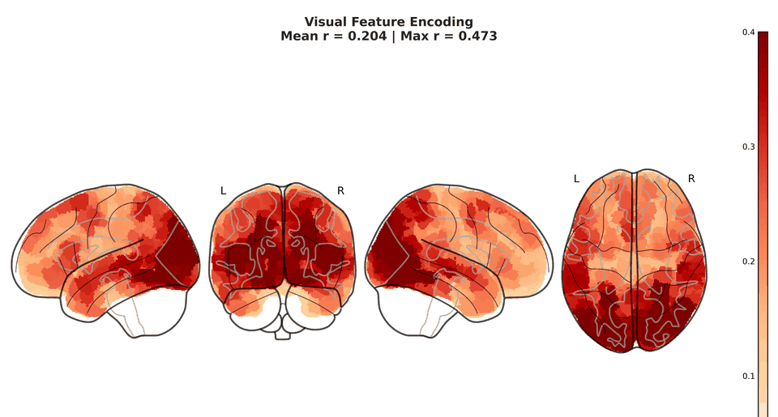
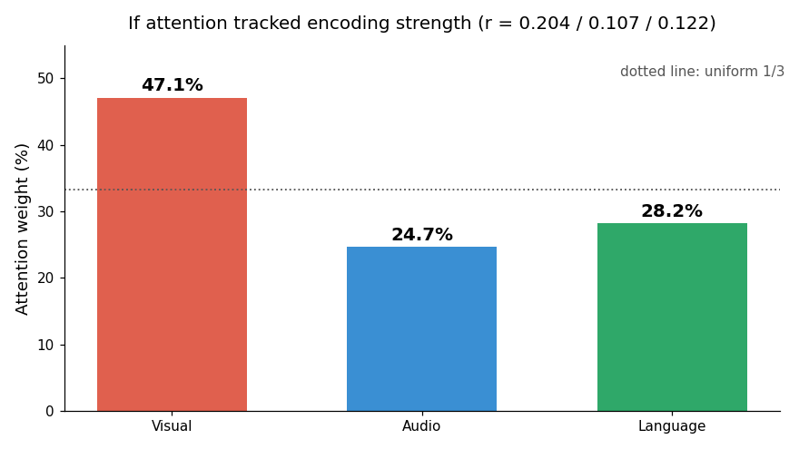
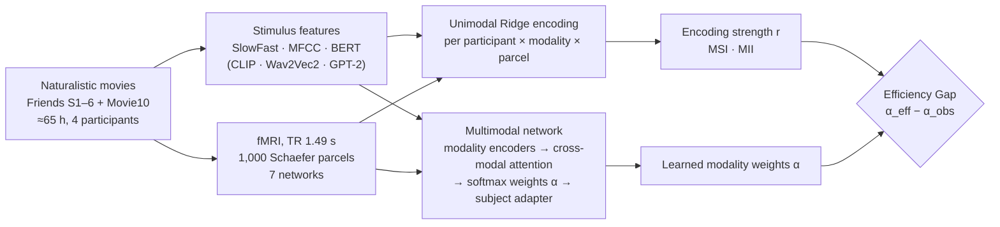
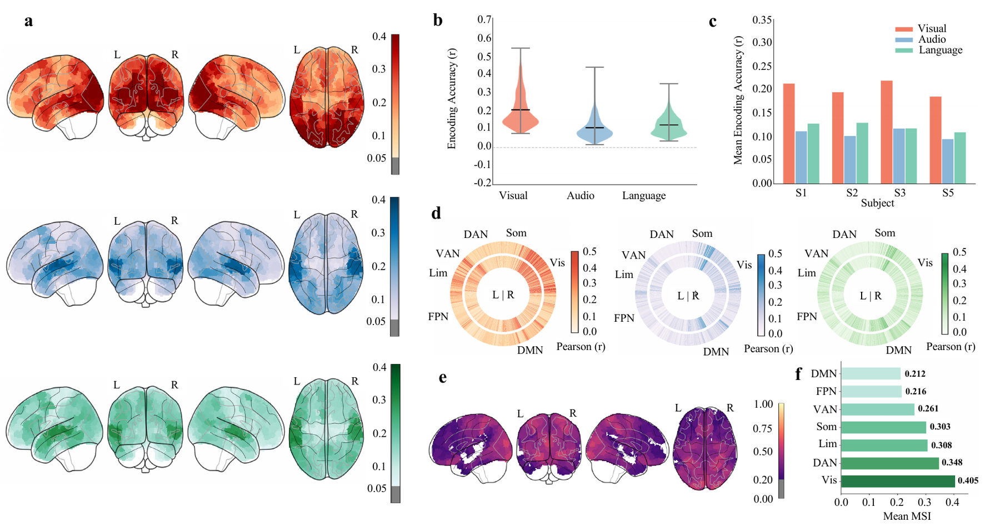
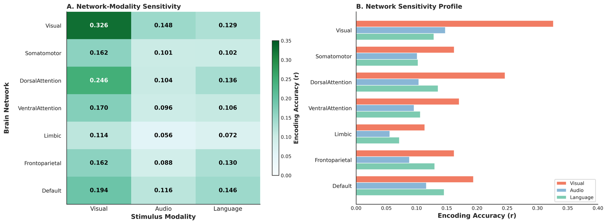
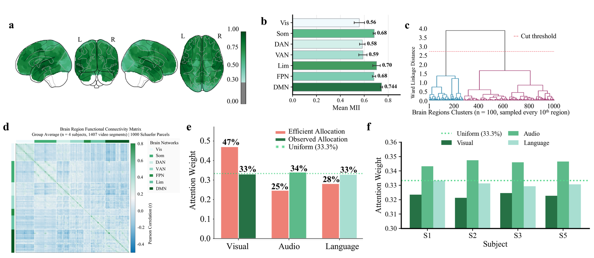
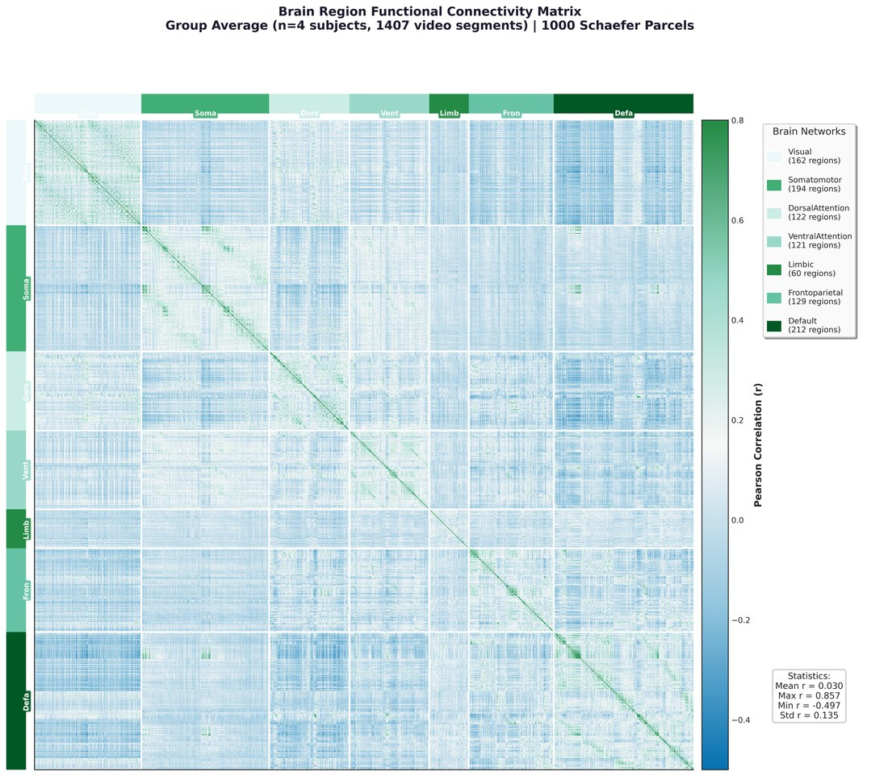
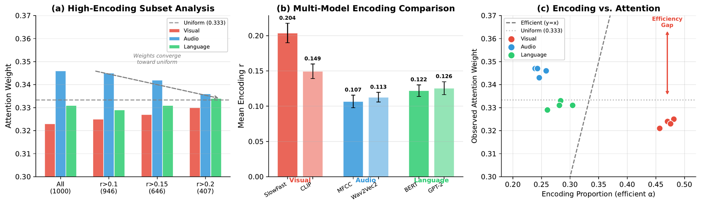
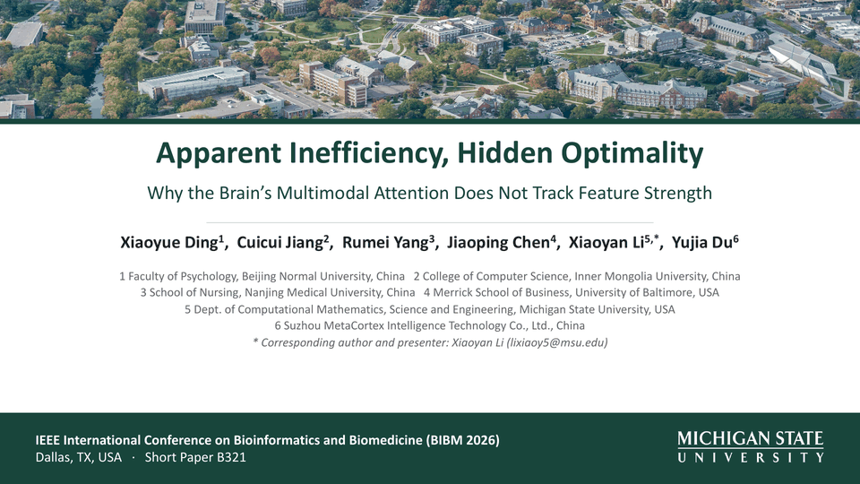

<div align="center">

# Apparent Inefficiency, Hidden Optimality

### Why the Brain's Multimodal Attention Does Not Track Feature Strength

[](https://www3.cs.stonybrook.edu/~bibm2026/)
[](https://algonautsproject.com/)
[](https://www.python.org/downloads/)
[](https://pytorch.org/)
[](LICENSE)

Xiaoyue Ding · Cuicui Jiang · Rumei Yang · Jiaoping Chen · **Xiaoyan Li**\* · Yujia Du

\*Corresponding author: lixiaoy5@msu.edu



<sub>Encoding strength of visual, audio and language features across 1,000 cortical parcels, followed by the Modality Specificity Index (four participants, ≈65 h of naturalistic movies).</sub>

</div>

---

## TL;DR

An efficient (Bayesian) observer should give the most attention to the most reliable signal. During naturalistic movie watching, **visual features dominate brain encoding** (mean r = 0.204 vs. 0.107 for audio and 0.122 for language; visual wins in 91% of parcels), yet the modality weights learned by a multimodal network **stay close to one third per modality**. We call this the **Encoding-Attention Dissociation** and test it against poor model fit, training dynamics and the choice of feature extractors.

<div align="center">

</div>

| | Visual | Audio | Language |
|---|:---:|:---:|:---:|
| Encoding r (Ridge, mean of 1,000 parcels) | **0.204** | 0.107 | 0.122 |
| Efficient allocation, α ∝ r | 47.1% | 24.7% | 28.2% |
| Learned modality weight α | 32.3% | 34.6% | 33.1% |
| Efficiency Gap (efficient − learned) | **+14.8** | −9.8 | −5.0 |

The Default Mode Network (DMN) sits at the top of an integration gradient: its Multimodal Integration Index is the highest of the seven Schaefer networks (MII = 0.744, cross-subject ICC = 0.89).

---

## Contents

- [Method](#method)
- [Results in figures](#results-in-figures)
- [Repository layout](#repository-layout)
- [Data](#data)
- [Reproducing the analyses](#reproducing-the-analyses)
- [Camera-ready notes](#camera-ready-notes)
- [Talk](#talk)
- [Citation](#citation)

---

## Method



- **Encoding strength.** Ridge regression per participant, modality and parcel (regularization from 10⁻³ to 10⁶), scored with Pearson r.
- **Attention allocation.** A personalized multimodal network with modality-specific MLP encoders (512-D), 8-head cross-modal attention and three learnable, softmax-normalized modality weights α. The weights are a *model-based* proxy for attention allocation, not a direct neural measurement.
- **Indices.** Modality Specificity Index (MSI), Multimodal Integration Index (MII) and the Efficiency Gap Δ = α<sub>eff</sub> − α<sub>obs</sub>, with α<sub>eff</sub> = r<sub>m</sub> / Σ r.

---

## Results in figures

### 1 · Visual features dominate encoding, most strongly in sensory networks





In the Visual network, visual features reach r ≈ 0.33, more than twice audio and language; in the DMN the three modalities are closest (0.19 / 0.12 / 0.15).

### 2 · Integration follows a gradient with the DMN as hub, while the learned weights stay balanced



<details>
<summary>Group-average functional connectivity (1,407 runs)</summary>



Within-network connectivity (mean r = 0.12) exceeds between-network connectivity (0.01; network-level t(26) = 6.4, p < .001), confirming the network partition used for the MII.

</details>

### 3 · Control analyses



| Concern | Control | Result |
|---|---|---|
| Poor model fit | Retrain on well-predicted parcels only (r > 0.1 / 0.15 / 0.2) | Weights become *more* balanced; CV 0.036 → 0.011 |
| Training dynamics | Halve the learning rate (5 × 10⁻⁵) | V / A / L = 0.328 / 0.343 / 0.329 |
| Feature extractor | Replace every extractor (CLIP, Wav2Vec2, GPT-2) | Visual > Language > Audio in every participant |

| Modality | Primary model (mean r) | Alternative model (mean r) |
|---|---|---|
| Visual | SlowFast 0.204 | CLIP 0.149 |
| Audio | MFCC 0.107 | Wav2Vec2 0.113 |
| Language | BERT 0.122 | GPT-2 0.126 |

---

## Repository layout

```
.
├── src/
│   ├── 01_train_unimodal_models.py          # Ridge encoding per modality          (III.A)
│   ├── 02_modality_contribution_analysis.py # MSI and modality dominance           (III.A)
│   ├── 03_brain_network_analysis.py         # network-level MII, DMN hub           (III.B)
│   ├── 04_train_multimodal_model.py         # multimodal network, learnable α      (III.C)
│   ├── 05_crossmodal_attention_analysis.py  # read out the learned weights         (III.C)
│   ├── 06_extract_additional_features.py    # CLIP / Wav2Vec2 / GPT-2 features     (III.D)
│   ├── 07_control_analyses.py               # subset, learning-rate, multi-model   (III.D)
│   ├── 08_init_control.py                   # sensitivity of α to its initialization
│   ├── 09_heldout_encoding.py               # Ridge r on held-out Friends S6 / Movie10
│   ├── 10_network_stats.py                  # network statistics from held-out encoding
│   ├── 11_camera_ready_fig2_data.py         # MII values for camera-ready Fig. 2b
│   ├── 12_camera_ready_fig2_panels.py       # camera-ready Fig. 2b and 2f panels
│   ├── 13_camera_ready_fig2d_check.py       # functional connectivity vs. encoding-profile similarity
│   ├── 14_camera_ready_fig2c_check.py       # clustering vs. canonical networks (ARI)
│   ├── brain_region_mapping.py              # Schaefer network index ranges
│   └── train_*_module.py                    # model and trainer definitions
├── scripts/run_full_analysis.py             # runs steps 1–7 into runs/run_<timestamp>/
├── resources/schaefer1000_7net.txt          # official Schaefer-1000 7-network labels
├── IEEE_manuscript/                         # camera-ready LaTeX source and PDF (B321)
└── assets/                                  # figures and animations used in this README
```

`data/` and `runs/` are not versioned (13 GB of fMRI and features; model checkpoints and caches).

---

## Data

All data come from the [Algonauts 2025 Challenge](https://algonautsproject.com/) (Courtois NeuroMod). Place them under `data/`:

```
data/
├── fmri/sub-0{1,2,3,5}/func/*.h5                     # Schaefer-1000 parcellated BOLD
├── features/official_stimulus_features/pca/friends_movie10/{visual,audio,language}/
└── stimuli/{movies,transcripts}/                     # only needed for step 6
```

Participant IDs follow the Algonauts release (there is no sub-04). If the PCA features live elsewhere, set `PCA_DIR` for scripts 08–09.

---

## Reproducing the analyses

```bash
pip install -r requirements.txt

python scripts/run_full_analysis.py          # steps 1–7 (a GPU is recommended for 4, 6, 7)

# camera-ready checks
python src/09_heldout_encoding.py 1          # one participant at a time: 1, 2, 3, 5
python src/10_network_stats.py
python src/11_camera_ready_fig2_data.py && python src/12_camera_ready_fig2_panels.py
python src/13_camera_ready_fig2d_check.py
python src/14_camera_ready_fig2c_check.py
python src/08_init_control.py --subject 1 --init visual --out runs/camera_ready/init/sub-01_visual.json
```

| Step | GPU | Typical time |
|---|:---:|---|
| 1 Unimodal Ridge encoding | – | ≈ 30 min |
| 4 Multimodal network | ✓ | ≈ 1 h |
| 6 Additional features | ✓ | ≈ 2 h |
| 7 Control analyses | ✓ | ≈ 1 h |

---

## Camera-ready notes

Relative to the submitted version, the camera-ready paper (`IEEE_manuscript/B321_camera_ready.pdf`) corrects several figures so that they agree with the text and tables:

- **Fig. 2b** was redrawn from the saved encoding results (DMN MII = 0.744 ± 0.009); the submitted panel showed placeholder values.
- **Fig. 2f** was redrawn from the data behind Table II.
- **Fig. 1c / 2f** label the fourth participant as S5 (Sub-05).
- **Fig. 2d** is described as functional connectivity, with within/between values recomputed (script 13); the clustering statement for Fig. 2c was revised to match script 14.
- **Fig. 2g** (temporal dynamics) was removed together with the paragraph that relied on it.

---

## Talk

<div align="center">

</div>

---

## Citation

```bibtex
@inproceedings{ding2026apparent,
  title     = {Apparent Inefficiency, Hidden Optimality: Why the Brain's Multimodal
               Attention Does Not Track Feature Strength},
  author    = {Ding, Xiaoyue and Jiang, Cuicui and Yang, Rumei and Chen, Jiaoping
               and Li, Xiaoyan and Du, Yujia},
  booktitle = {Proceedings of the IEEE International Conference on Bioinformatics
               and Biomedicine (BIBM)},
  year      = {2026}
}
```

## Acknowledgments

This work used data from the Courtois NeuroMod project and the Algonauts 2025 Challenge.

## License

MIT License. See [LICENSE](LICENSE).
